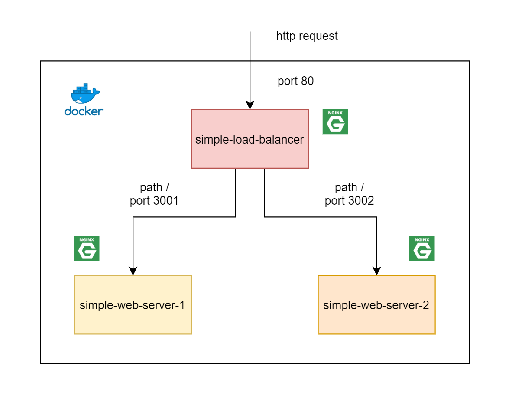

# Simple Load Balancer (Run on Docker)



# Requires

- Docker 

# Steps 

### 1. Clone

```sh
$ git clone https://github.com/jittagornp/nginx-example.git
$ cd nginx-example
$ cd simple-load-balancer 
```

### 2. Create Web Server 1 

2.1 Build Docker Image

```sh
$ cd web-1
$ docker build -t simple-web-server-1 .  
$ docker images 
```

2.2 Run Container

```sh
$ docker run -d -p 3001:80 --name simple-web-server-1 --restart=always simple-web-server-1 
$ docker ps -a
```

2.3 Test

> http://<HOST_NAME or IP>:3001

### 3. Create Web Server 2 

3.1 Build Docker Image

```sh
$ cd web-2
$ docker build -t simple-web-server-2 .  
$ docker images 
```

3.2 Run Container

```sh
$ docker run -d -p 3002:80 --name simple-web-server-2 --restart=always simple-web-server-2 
$ docker ps -a 
```

3.3 Test

> http://<HOST_NAME or IP>:3002

### 4. Create Load Balancer 

4.1 Build Docker Image

```sh
$ cd load-balancer 
$ docker build -t simple-load-balancer .  
$ docker images 
```

4.2 Run Container

```sh
$ docker run -d -p 80:80 --name simple-load-balancer --restart=always --link=simple-web-server-1 --link=simple-web-server-2 simple-load-balancer 
$ docker ps -a 
```

4.3 Test

> http://<HOST_NAME or IP>
