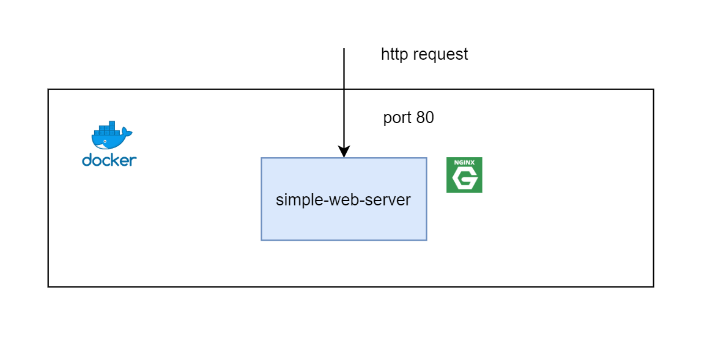

# Simple Web Server (Run on Docker)



# Prerequisites

- Docker 

# Steps 

### 1. Clone 

```sh
$ git clone https://github.com/jittagornp/nginx-example.git
$ cd nginx-example
$ cd simple-web-server
```

### 2. Build Docker Image 

```sh 
$ docker build -t simple-web-server .  
$ docker images 
```

### 3. Run Container 

```sh
$ docker run -d -p 80:80 --name simple-web-server --restart=always simple-web-server 
$ docker ps -a 
```

### 4. Test

> http://<HOST_NAME or IP>
